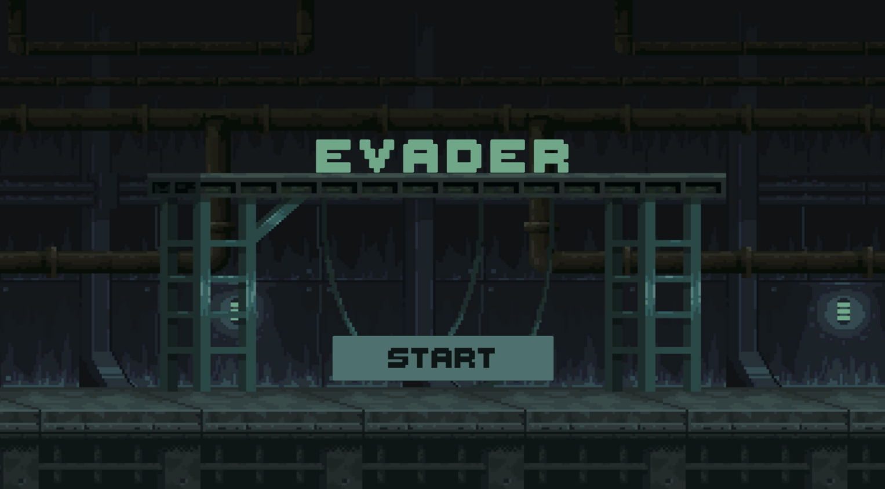
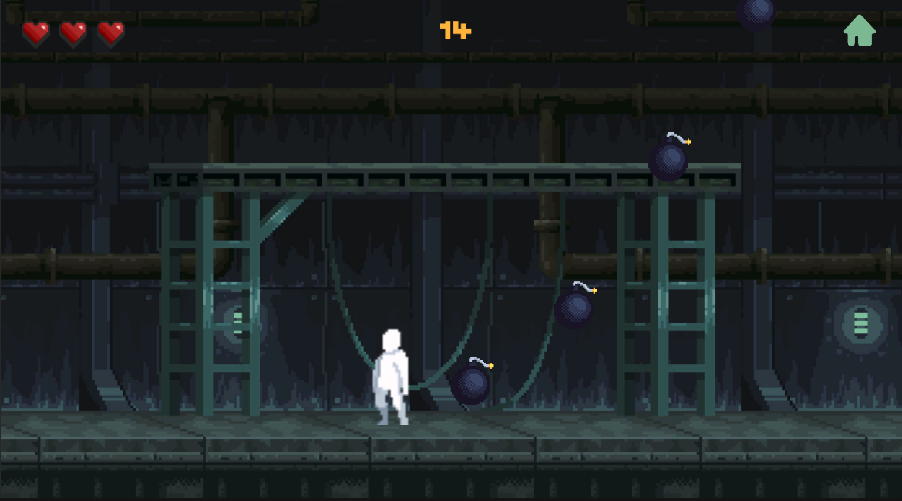
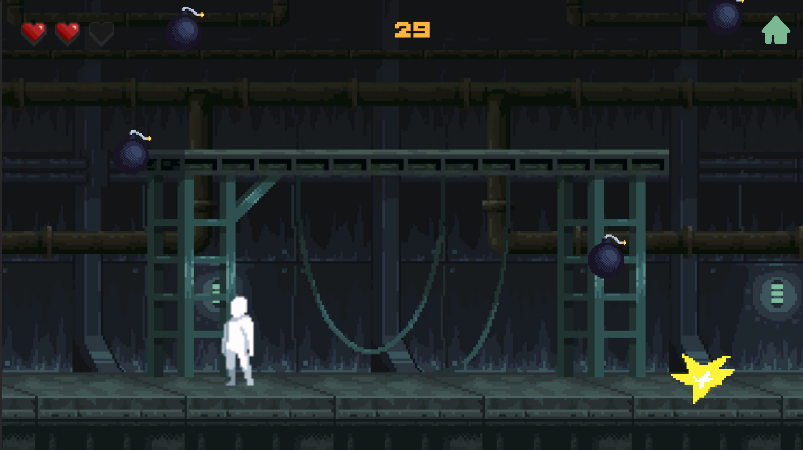
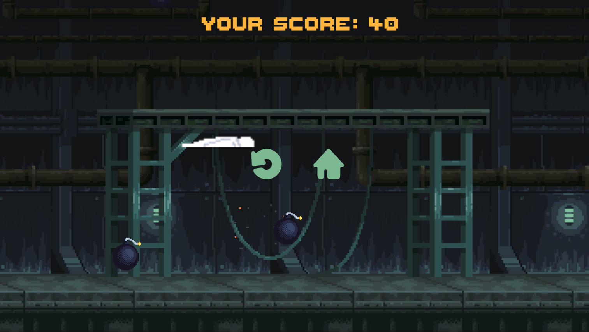

# Evader

## !! ARCHIVE !!

This repo is archive now and no more updates will be done anymore. It will act as poc for my starting of GD journey.

Evader is a 2D game built in Unity Engine in which the sigma male have to stay away from bomb in order to keep grinding...

  

## Screeshots

Here are some images of the project so far.

### Main Menu

### GamePlay

### BombBlast

### GameOver (Ascending To Heaven)

## Features

- [X] Main Menu
- [X] Background Music (Both in Main Menu & in GamePlay)
- [X] Player Animation (Idle/ Moving/ Dying)
- [X] Player GameOver SFX
- [X] Bomb Explosions & SFX

## TODO (IN NEAR FUTURE)

- [ ] Blurry Screen When GameOver
- [ ] Freeze Player After Death (It still moves.)
- [ ] Add Volume Control Settings

## CREDITS

Font - [Thaleah Fat](https://tinyworlds.itch.io/free-pixel-font-thaleah) - [TinyWorlds](https://tinyworlds.itch.io/)

Player & Player Animations - [Pixel Prototype Player](https://deadrevolver.itch.io/pixel-prototype-player-sprites) - [Dead Revolver](https://deadrevolver.itch.io/)

Bomb Animation - [Pixel Explosion](https://nyknck.itch.io/explosion) - [NYKNCK](https://nyknck.itch.io/explosion)

Background - [BulkHead Walls Environment](https://ansimuz.itch.io/bulkhead-walls-environment) - [ANSIMUZ](https://ansimuz.itch.io/)

Bomb SFX - [AudioSoundClip](https://audiosoundclips.com/8-bit-explosion-blast-sound-effects-sfx/)
